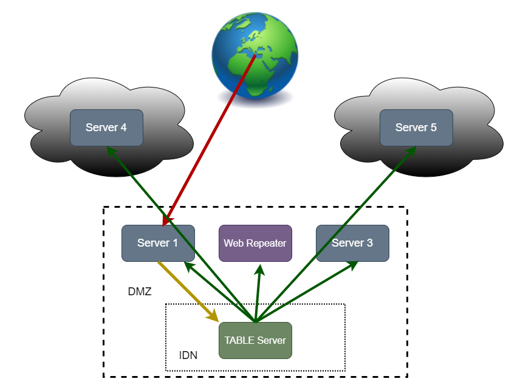
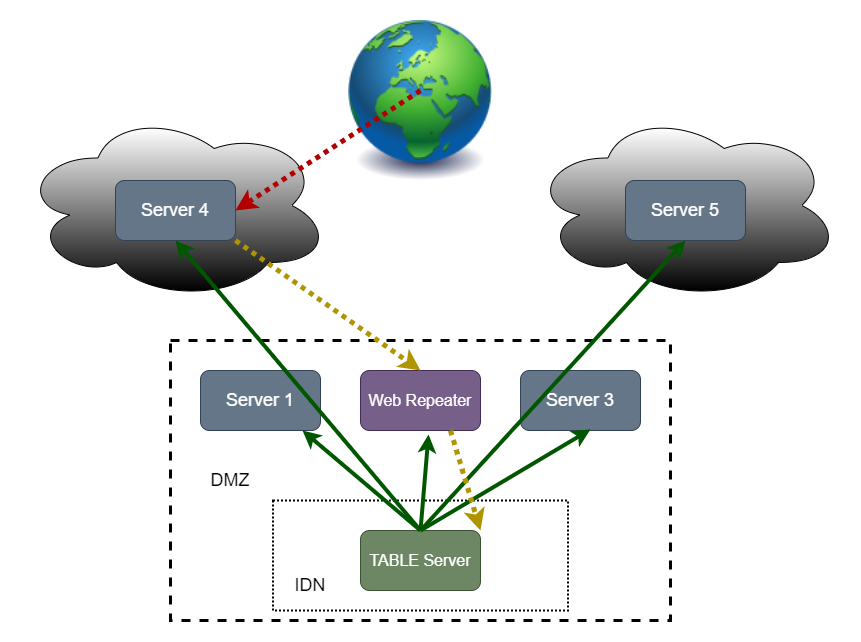
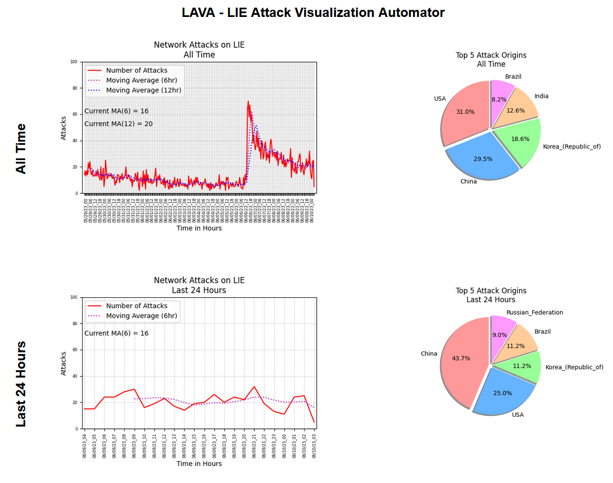

## TABLE 1.0 by LEVEL6 (https://github.com/lleevveell66)

<link rel="stylesheet" type="text/css" href="css/github.css"> 

<h1 align="center">
  
</h1>

A distributed, ham-fisted, attack sensoring, IPS/IDS/firewall solution.  Take your bandwidth back.<br>


## Table of contents:

* [Table of Contents](#table-of-contents) 
* [Description](#description)
	* [Why?](#why)
* [Theory of Operation](#theory-of-operation) 
	* [Attack Scenarios](#attack-scenarios)
		* [Scenario 1](#scenario-1)
		* [Scenario 2](#scenario-2)
	* [Hardware Components](#hardware-components)
	* [Software Components](#software-components)
	* [Other Ideas](#other-ideas)
* [Requirements](#requirements)
* [Build Your Own](#build-your-own)
	* [Hardware](#hardware)
	* [Software](#software)
* [LIE TABLE_ips](#lie-table_ips)
* [Real World Study](#real-world-study)
* [Caveats and Dangers](#caveats-and-dangers)


## Description:
[Table of Contents](#table-of-contents)

TABLE is a distributed IDS (Intrusion Detection System) and IPS (Intrusion Prevention System) which uses only common linux tools to detect attacks and distribute the protection from further attack.

Implementation is generally straight-forward to implement on your own network of servers, but LIE is also providing an hourly-updated ipset built from their own implementation involving 7 hosts around the world.

All previous generations of solutions which have led to this (DDoP - Distributed Denial of Packets, FIBN - Firewall ipset Blacklist Network, et al) have been retired and will be removed, soon.  I never properly kept up with their repos as they evolved, anyway.  TABLE is what they all became.

### Why?:

Network scanning and attacks have proliferated so much that the traffic generated can signifigantly affect the overall bandwidth you have available for legitimate use.


## Theory of Operation:
[Table of Contents](#table-of-contents)

We will refer to the following diagrams for this explanation:

<h4 align="center"> 
<table cellpadding="3" cellspacing="3" border="0">
<tr><td>
    <br>
    TABLE Scenario 1
</td><td>
    <br>
    TABLE Scenario 2
</td></tr>
</table>
</h3> 

### Attack Scenarios:

An "attack" in these scenarios is defined as being "a completed TCP socket connection to a honey pot port".

You are going to begin to sense that this solution uses a tank to kill a fly, and your sense will be correct.  You may continue to develop this further and tweak it to be less ham-fisted about things, if you like.  The TABLE solution, as it stands, would not be a desirable solution for any network which requires connectivity to many places in the world for commerce, for example.  My network does not.  I would frankly be fine with blocking the entire countries of China, Russia, Iran, and Brazil.  This is indeed what I have tried to do in the past.  It works, for a while.  But, it must be kept in sync with changing CIDR blocks in the world, and that can require subscription fees, etc.

As it stands, all atttacking IP addresses in the US are blocked on their aaa.bbb.ccc.0/24 subnet.  All attacking IP addresses outside of the US are blocked on their aaa.bbb.0.0/16 subnet.  You can certainly change this behavior to be less aggresive, but be aware of ipset's limits.  If you begin only blocking single (/32) IP addresses, you will quickly overwhelm your firewall tables.

#### Scenario 1:

Scenario 1 illustrates an attack on Server 1 by some machine in "The World".

1) The World attacks Server 1
2) Server 1 recognizes this attack
3) Server 1 reports the details about the attack to the TABLE Server  
4) TABLE Server makes some quick decisions about where in the world this attack originated, using IP geolocation
5) TABLE Server initiates an Ansible playbook to reach out to all of the participating servers
6) Each participating server inserts the appropriate subnet into the TABLE_ips ipset
7) All further attacks from this subnet to all participating hosts are stopped

#### Scenario 2:

Scenario 2 illustrates the extra step required for an atack on a remotely-hosted Server 4 by some machine in "The World".

1) The World attacks Server 4 
2) Server 4 recognizes the attack 
3) Server 4 reports the details about the attack to the Web Repeater
4) Web Repeater relays the attack information back into the TABLE Server 
5) TABLE Server makes some quick decisions about where in the world this attack originated, using IP geolocation
6) TABLE Server initiates an Ansible playbook to reach out to all of the participating servers
7) Each participating server inserts the appropriate subnet into the TABLE_ips ipset
8) All further attacks from this subnet to all participating hosts are stopped

### Hardware Components:

TABLE is distributed among as many hosts as possible.  The more hosts that participate, the quicker TABLE will work to minimize sources of attack.

The diagrams show servers in a personal network (IDN + DMZ) as well as virtualized instances in two different clouds (maybe Linode and AWS).  Hosts in your local network are slightly easier to set up, because they will most likely have direct inward connectivity from the DMZ (De-Militarized Zone) to the TABLE Server in the IDN (Internal Data Network).  Servers hosted outside of the network where the TABLE Server lives will require some trickery to reach the TABLE Server.  A "table_relay.cgi" script has been written in Perl and supplied, but feel free to devise your own method.  Port forwarding is another possibility, but not recommended.  You could also chance hosting the TABLE Server on a Web Server in your DMZ, eliminating the need for connectivity to the IDN.

This is the only hardware really required for this to work - *nix servers.  If you have separate hardware firewalls, you will need to develop for that.  


### Software Components:

The following have been developed to help you to get this set-up on your own network:

* table_reporter - This is a bash script that is placed on every participating server to report attacks
* table_block - This is a bash script that is placed on every participating server to finally block the attacker
* table_activity.cgi - This is a Perl CGI script hosted on the TABLE Server which listens for table_reporter reports, makes decisions about the attacking subnet, then runs the table_blocknet script
* table_relay.cgi - This is a Perl CGI script hosted on the Web Repeater which listens for table_reporter reports, then relays those inwardly to the table_activity.cgi script on the TABLE Server
* table_blocknet - This is a bash script that is executed on the TABLE Server to kick off the BlockSubnet.yaml Ansible playbook
* BlockSubnet.yaml - This is an Ansible playbook which will connect to all participating machines and execute their local table_block scripts to finally block the attacking subnet.  This is done via SSH keys in my scenario, but feel free to change that.
* portsentry-leper-1.2.317.005.tgz - A customized release of the old portsentry tool, from before Psionic sold out to Cisco.  This is what is being used to detect the attacks on every server and execute the table_reporter scripts.  There are many other ways, but this is supplied for you.

You will understand, of course, if I need to cleanse all of this a bit to safely share all of this publically.  It will likely require effort on your part to dirty it back up for your own environment.  But, the general procedure will be provided, here.


```
    This is a code block
```

### Other Ideas:

List some other expansion or customization ideas, here.

* Build a dedicated TABLE network fully in a cloud, dropping off the ipset for retreival and use elsewhere
* More strategic virtual host placement to study in more detail the most likely sources of attack in other locations in the world
* Easy integration with fail2ban for another layer of valid attack detection on legitimate, non-honeypot ports
* World heat maps of attacks through the ages (nothing says you have to actually block them)

## Requirements:
[Table of Contents](#table-of-contents)

You will need the following installed to duplicate this project, although much substitution is possible given a little thought:

* A few *nix servers
* iptables
* httpd
* sudo/sudoers
* Perl
* Ansible
* .. more to come ... 


## Build Your Own:
[Table of Contents](#table-of-contents)

We will walk you through an implementation of this, here.  All of the scripts are very simple.  Hate Perl?  Port it to Python and bow to your Indentation Overlords.   Big firewalld fan boi?  Easy peasy to customize for your needs.

### Hardware:
[Table of Contents](#table-of-contents)

### Software:
[Table of Contents](#table-of-contents)

## LIE TABLE_ips
[Table of Contents](#table-of-contents)

Just want the TABLE_ips ipset?  We got you.  We realize that not everyone will wish to implement such a distributed solution, especially since it requires much customization for one's own environment.  So, we have made the TABLE_ips ipset generated hourly at LIE available to everyone.

https://www.leper.org/TABLE/

Directions for how to utilize this ipset are included on that page.

If you do not use/like ipset or iptables, this file is easily massaged to utilize in your favorite firewall solution.


## Real World Study
[Table of Contents](#table-of-contents)

<h1 align="center">
  
</h1>

A real-world study of the efficiency of the TABLE solution is included, here.

Write up my testing, here.   Include all the screenshots of LAVA charts.

Until I get this filled in, just know that during the first 7 days of running TABLE, a 6-hour moving average of attacks dropped from around 20 to 5 attacks per hour.  This was using TABLE on top of previous implemented solutions.  Then, all firewall tables were cleared.  Attacks jumped immediately to over 60 per hour.  Within 3 days, this has dropped by 66% back down near 20 attacks per hour.

All other connectivity on my network is fine. 


## Caveats and Dangers
[Table of Contents](#table-of-contents)

Of course, there is always a bit of risk when taking such drastic pro-active measures.  Here are some points to keep in mind:

* You could just use iptables (or other tools) to watch for all port scans, but beware that SYN packets are much more easily spoofed than completed TCP socket connections.  Still... these connections can also be spoofed.  MAKE A GOOD WHITELIST!  Include uplinks through your provider(s) in it.  
* It is highly recommended that you never take counter-offensive measures.  Do not taunt, do not back-hack nor scan.   It should be enough to know that some automaed bot in some subnet found you.   If you begin to provoke them, you will eventually experience much more trouble than this solution can protect you from.  
* The determination of subnet is "precise enough".  But, beware that sometimes these subnets will contain more than one country. The TABLE scripts do not check the entire subnet.  Contrarily, only one IP address in that subnet is checked, and then the assumption is made that the rest of that subnet also originates in that country.  This is a bad assumption and why this is being called "ham-fisted".  But, it does work well when you care less about sharing services to the world.


EOT
